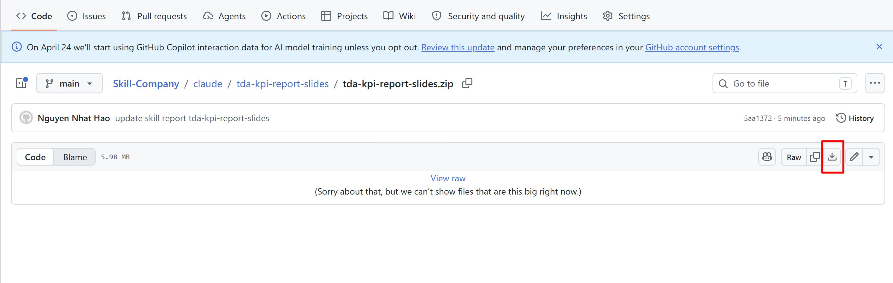
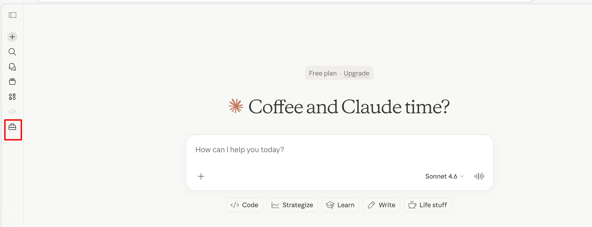
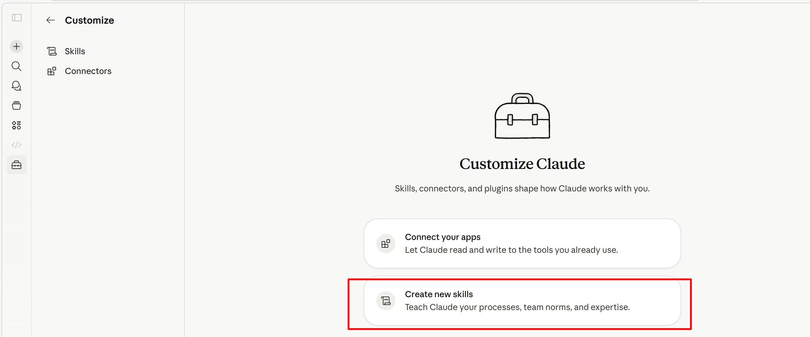
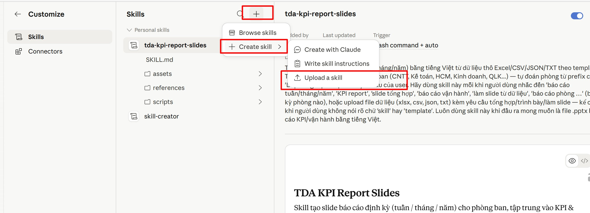

# TDA KPI Report Slides — Hướng dẫn triển khai

Skill **`tda-kpi-report-slides`** dành cho Claude AI, giúp tự động tạo slide báo cáo định kỳ (tuần / tháng / năm) bằng tiếng Việt từ dữ liệu thô (Excel, CSV, JSON, TXT) theo đúng bộ nhận diện thương hiệu của Tôn Đông Á.

---

## 1. Skill này dùng để làm gì?

- Tự động tổng hợp dữ liệu công việc → xuất file PowerPoint (`.pptx`) báo cáo định kỳ.
- Hỗ trợ nhiều phòng ban: **CNTT, Kế toán, HC-NS, Kinh doanh, Quản lý kho, …** — tự đoán phòng từ prefix cột "Loại công việc" hoặc theo yêu cầu của người dùng.
- Đảm bảo 100% slide xuất ra đúng template, màu sắc, logo, font chữ chuẩn của Tôn Đông Á.
- Rút ngắn thời gian làm báo cáo định kỳ từ **vài giờ xuống còn vài phút**.

---

## 2. Yêu cầu trước khi cài đặt

| Yêu cầu | Ghi chú |
|---|---|
| Tài khoản Claude.ai | Hỗ trợ cả Free, Pro, Team, Enterprise |
| Trình duyệt web | Chrome, Edge, Firefox, Safari (bản mới) |
| File skill (zip) | `tda-kpi-report-slides.zip` (~6 MB) |

---

## 3. Cấu trúc thư mục skill

```
tda-kpi-report-slides/
├── SKILL.md                              # File hướng dẫn chính cho Claude
├── README.md                             # File hướng dẫn triển khai (file này)
├── assets/
│   └── template/
│       ├── report-template.pptx          # Template gốc của Tôn Đông Á
│       ├── cover-background.jpg          # Background trang bìa
│       └── logo-header.jpg               # Logo Tôn Đông Á
├── references/
│   ├── design-tokens.md                  # Bộ màu, font, size chuẩn
│   ├── edit-template.md                  # Hướng dẫn chỉnh sửa template
│   ├── building-blocks.md                # Snippet xây dựng các khối slide
│   └── layout-patterns.md                # Pattern library 6 layout content
├── scripts/
│   └── build_example.py                  # Script Python mẫu
└── docs/
    └── images/                           # Ảnh minh họa cho README
```

---

## 4. Hướng dẫn triển khai

### Bước 1. Tải file skill về máy

Truy cập repo nội bộ (hoặc nguồn được chia sẻ) và tải file `tda-kpi-report-slides.zip` về máy bằng cách bấm vào nút **Download** (biểu tượng mũi tên xuống) ở góc phải:



> **Lưu ý:** Giữ nguyên định dạng `.zip`, **không giải nén** trước khi upload lên Claude.

---

### Bước 2. Mở mục Customize trong Claude

Đăng nhập vào [claude.ai](https://claude.ai), sau đó bấm vào biểu tượng **vali (Customize)** ở thanh sidebar bên trái:



---

### Bước 3. Chọn “Create new skills”

Trong trang Customize Claude, chọn mục **Create new skills — Teach Claude your processes, team norms, and expertise**:



---

### Bước 4. Upload file skill

Trong trang Skills, bấm dấu **`+`** ở góc trên → chọn **`Create skill`** → chọn **`Upload a skill`**, sau đó chọn file `tda-kpi-report-slides.zip` đã tải ở Bước 1:



Sau khi upload thành công, skill `tda-kpi-report-slides` sẽ hiện trong danh sách **Personal skills** với đầy đủ các thư mục `assets`, `references`, `scripts` và file `SKILL.md`.

> **Lưu ý:** Nhớ **bật toggle** kích hoạt skill (góc phải trên trang chi tiết skill) để Claude có thể sử dụng được.

---

## 5. Cách sử dụng skill

Sau khi cài đặt, mở một cuộc hội thoại mới với Claude và sử dụng theo một trong các cách sau:

### Cách A — Upload file dữ liệu thô và yêu cầu trực tiếp

Kéo thả file Excel/CSV vào khung chat kèm câu yêu cầu, ví dụ:

> *"Làm báo cáo tháng 4/2026 cho phòng CNTT từ file đính kèm."*

Claude sẽ tự động kích hoạt skill và xuất file `.pptx` chuẩn template.

### Cách B — Yêu cầu chung chung, để Claude hỏi lại

> *"Giúp tôi làm slide báo cáo tuần."*

Claude sẽ hỏi rõ phòng ban, kỳ báo cáo, sau đó yêu cầu upload dữ liệu.

### Các cụm từ kích hoạt skill phổ biến

- *"Báo cáo tuần / tháng / năm"*
- *"KPI report"*
- *"Slide tổng hợp"*
- *"Báo cáo vận hành"*
- *"Làm slide từ dữ liệu"*
- *"Báo cáo phòng [tên phòng]"*

---

## 6. Định dạng file dữ liệu đầu vào

Skill đọc được các định dạng:

| Định dạng | Công cụ đọc |
|---|---|
| `.xlsx`, `.xls` | pandas + openpyxl |
| `.csv`, `.tsv` | pandas |
| `.json` | json + pandas |
| `.txt` | đọc raw |

### Cột dữ liệu khuyến nghị

File dữ liệu nên có (tối thiểu) các cột sau:

- `Loại công việc` — có prefix theo phòng (vd `CNTT-HT-...`, `KT-...`, `HCM-...`)
- `Tên công việc` — mô tả ngắn
- `Tình trạng` — đã hoàn thành / đang xử lý / chưa làm
- `Ngày hoàn thành` hoặc `Ngày tạo` — để xác định kỳ báo cáo

Skill sẽ tự động loại bỏ các cột nhiễu (`Lý do hủy`, `Đơn vị`, `Phối hợp`, `Để biết`, …) trước khi tổng hợp.

---

## 7. Tùy biến cho phòng ban mới

Mặc định, skill đã có mapping cho phòng **CNTT**. Để mở rộng cho phòng khác:

1. Mở file `SKILL.md`, tìm phần `DEPT_PREFIXES` và `DEPT_FULLNAME`.
2. Thêm dòng mới với prefix tương ứng, ví dụ:
   ```python
   DEPT_PREFIXES = {
       ...,
       "MKT": ["MKT-", "Marketing-"],   # Phòng Marketing
   }
   DEPT_FULLNAME = {
       ...,
       "MKT": "PHÒNG MARKETING",
   }
   ```
3. Lưu file, đóng gói lại thành `.zip` rồi upload lại lên Claude (xem Bước 4).

> **Mẹo:** Nếu chưa có mapping, Claude sẽ tự sinh mapping dựa trên data thực tế và **hỏi xác nhận** trước khi xuất slide — không cần phải sửa file SKILL.md ngay.

---

## 8. Xử lý sự cố thường gặp

| Vấn đề | Nguyên nhân | Cách khắc phục |
|---|---|---|
| Slide bị lỗi font tiếng Việt (ô vuông, "???") | Font Inter / Open Sans chưa được nhúng | Mở slide bằng PowerPoint, vào File → Options → Save → tick "Embed fonts in the file" |
| Logo / background trang bìa bị mất | File asset bị lỗi khi upload | Upload lại file `.zip` đầy đủ, không giải nén trước |
| Skill không tự kích hoạt khi yêu cầu | Toggle skill chưa bật | Vào Customize → Skills → bật toggle ở góc phải skill |
| Báo cáo bị thiếu nhóm công việc | Prefix cột "Loại công việc" chưa đúng | Kiểm tra lại file dữ liệu, đảm bảo prefix khớp với mapping trong `SKILL.md` |
| File `.pptx` xuất ra quá ít / quá nhiều slide | Mật độ nội dung không đủ | Skill sẽ tự co giãn 4–15 slide. Nếu muốn cố định số slide, ghi rõ trong yêu cầu (vd "làm 8 slide") |

---

## 9. Bảo trì và cập nhật

- **Phiên bản hiện tại:** 1.0 (tháng 5/2026)
- **Đơn vị quản lý:** Phòng Công nghệ thông tin — Công ty Cổ phần Tôn Đông Á
- **Đầu mối hỗ trợ:** Liên hệ Phòng CNTT qua EOffice hoặc email nội bộ

Khi có thay đổi về template (logo mới, đổi màu thương hiệu, layout mới), Phòng CNTT sẽ cập nhật file zip mới và thông báo qua kênh nội bộ. Người dùng chỉ cần upload lại file mới (Claude sẽ tự thay thế phiên bản cũ).

---

## 10. Tài liệu tham khảo

- `SKILL.md` — Hướng dẫn chi tiết quy trình 6 bước Claude áp dụng
- `references/design-tokens.md` — Hệ màu, font, size chuẩn
- `references/layout-patterns.md` — 6 mẫu layout content slide
- `references/edit-template.md` — 7 quirks cần lưu ý khi chỉnh sửa template
- `scripts/build_example.py` — Script Python mẫu, có thể chạy độc lập

---

*Tài liệu được biên soạn bởi Phòng CNTT — Tôn Đông Á.*
